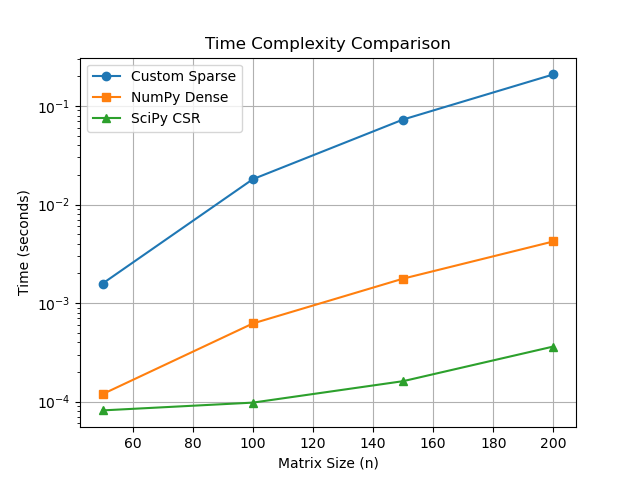
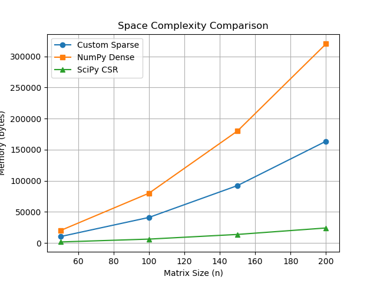

# Sparse Matrix Complexity Analysis

**Name:** Damien Ortiz  
**Date:** 04/10/2026  
**Implementation:** DOK (Dictionary of Keys)

---

## Overview

This implementation uses a Dictionary of Keys structure backed by a custom hash table. Each non zero value is stored as a key value pair where the key is a tuple (row, col) and the value is the matrix entry.

This approach is useful for sparse data because it only stores values that are not equal to the default. This saves memory when most entries are zero, which is common in tile maps and large grids.

The main advantage of this method is fast lookup and insertion using hashing. However, it does not organize data by rows or columns, which makes matrix multiplication slower compared to more optimized formats like CSR.

---

## Time Complexity

| Operation | My SparseMatrix | scipy sparse (CSR) | numpy dense |
|-----------|------------------|--------------------|-------------|
| set(r, c, v) | O(1) average | O(nnz) amortized | O(1) |
| get(r, c) | O(1) average | O(log nnz) | O(1) |
| items() iteration | O(nnz) | O(nnz) | O(n^2) |
| multiply(other) | O(nnz^2) | O(nnz^2 / n) | O(n^3) |

nnz is the number of non zero elements and n is the matrix size.

The set operation is constant time on average because it uses a hash table. The get operation is also constant time for the same reason. Iterating over items takes time proportional to the number of stored elements.

The multiply function uses two nested loops over all non zero elements in both matrices. This results in O(nnz^2) time because every pair of elements is compared.

---

## Benchmark Results

The graph shows that NumPy grows quickly as matrix size increases because it performs dense multiplication. The custom sparse matrix is slower than SciPy due to the inefficient multiplication method. SciPy performs best because it uses an optimized CSR structure.

---

## Space Complexity

| Representation | Space Used |
|----------------|-----------|
| Dense n x n    | O(n^2)    |
| My sparse    | O(nnz)    |

The dense matrix stores every value, so its space grows with n squared. The sparse matrix only stores non zero values, so its space grows with nnz.

From the space complexity graph, the custom sparse matrix uses less memory than dense matrices when the number of non zero elements is small. However, because of hash table overhead, each entry takes more space than a simple array element.

The point where sparse becomes less efficient happens before the matrix is fully dense. In practice, this happens around 20 to 30 percent density because each stored entry has extra memory cost.

---

## Observations

1. The custom sparse matrix is much slower than SciPy because it uses a simple multiplication algorithm with nested loops.

2. Sparse matrices are faster than dense ones when the matrix has very few non zero values, since they skip unnecessary calculations.

3. The memory overhead of the hash table is noticeable. Each entry takes more space than a single value in a NumPy array.

---

## Conclusions

This experiment showed that sparse matrices are useful for saving memory when data is mostly empty. However, the way the data is stored has a big impact on performance. A simple DOK structure is easy to build but not efficient for heavy operations like multiplication. More advanced formats like CSR improve both speed and memory usage.

---

## References

- NumPy Documentation  
- SciPy Sparse Matrix Documentation  
- Course lecture notes  